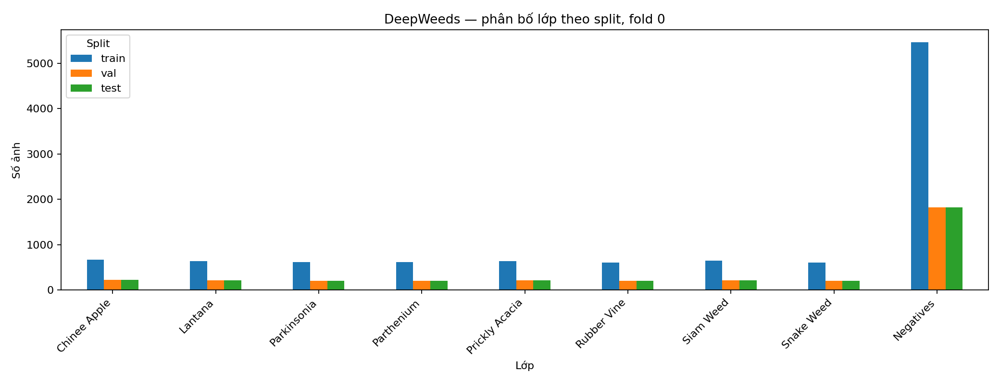
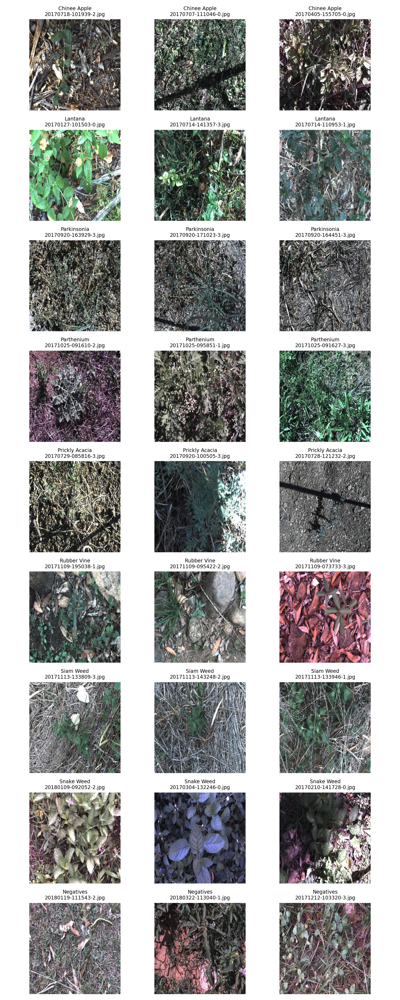
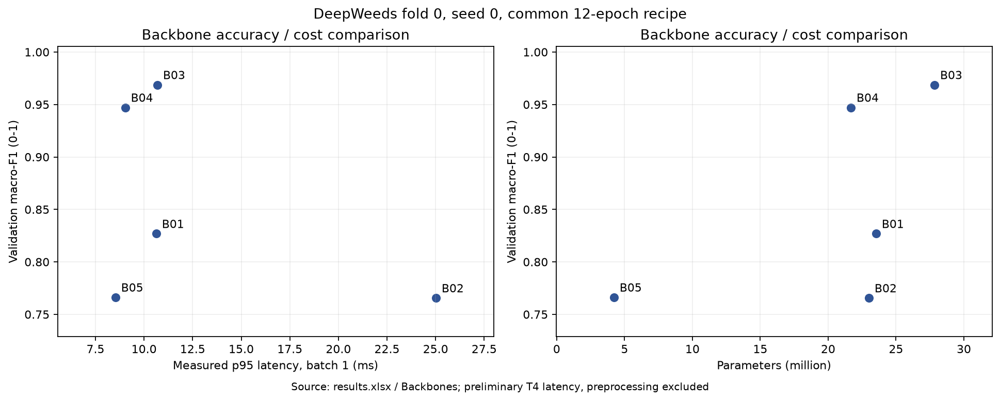
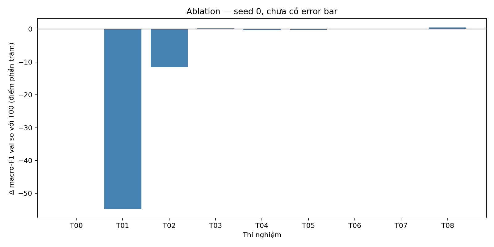
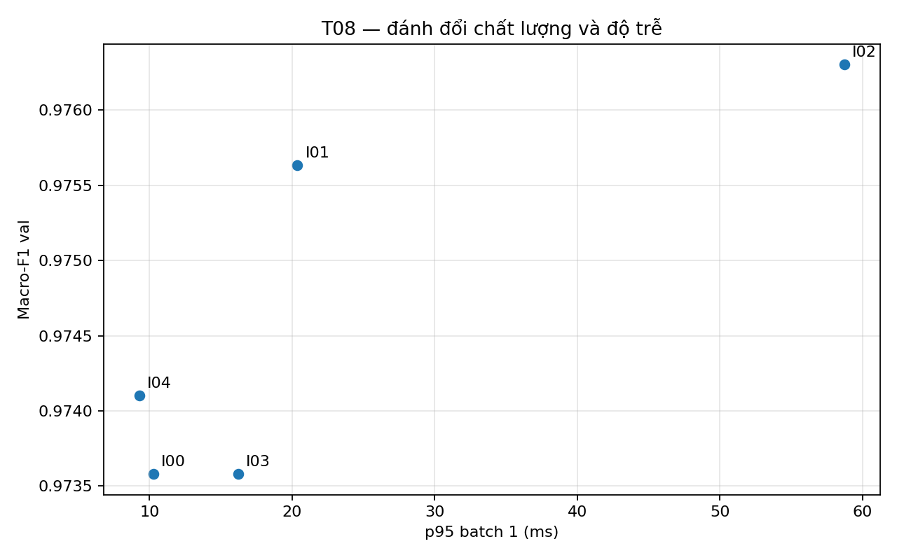
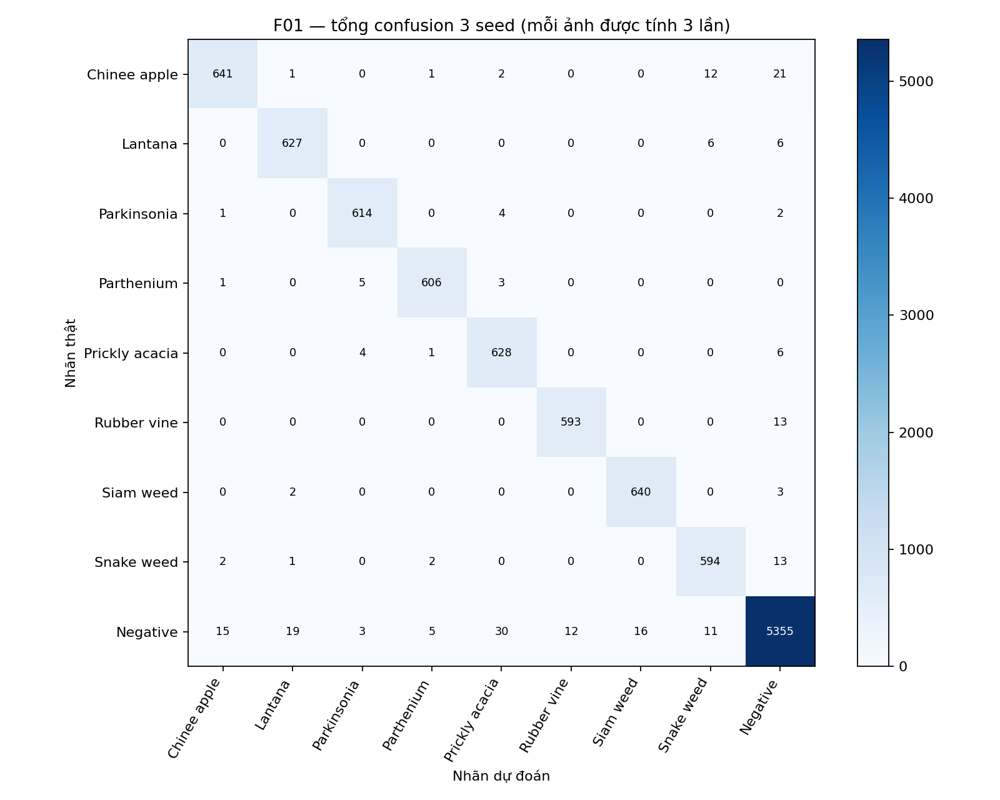
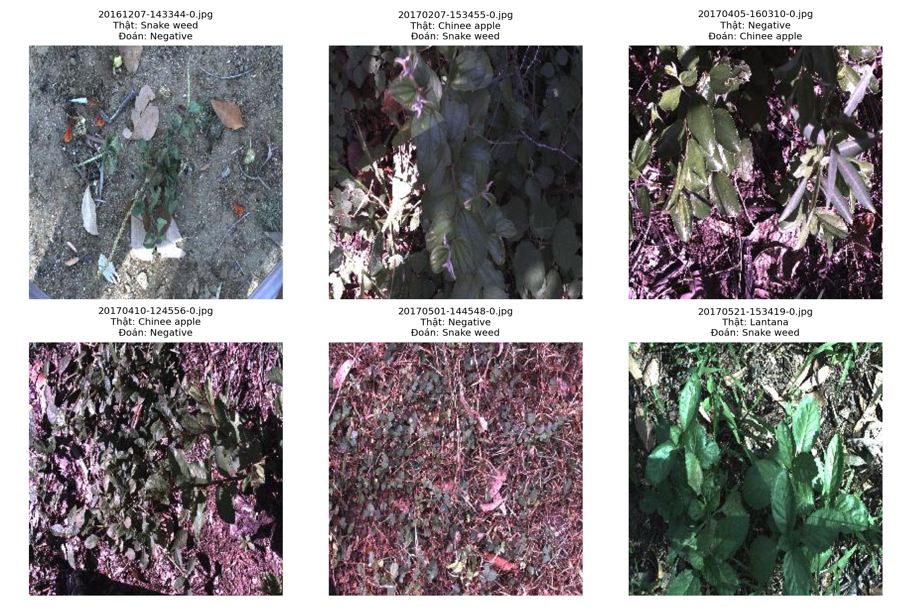

# Báo cáo Lab Day 2 — DeepWeeds

Sinh viên: Nguyễn Văn Hồng  
MSSV: 2A202602800  
Notebook: https://colab.research.google.com/drive/1hHWr3tceI_zQFmJ2MLObZo4HFrgQvVIu

## 1. Tóm tắt

So sánh 5 backbone, ablation ba trục khởi tạo, augmentation và loss,
rồi thử 4 phương pháp suy luận ngoài mốc 1-view.
Cấu hình cuối dùng ConvNeXt-Tiny, CutMix, label smoothing 0.1
và temperature scaling.

Qua 3 seed, macro-F1 test đạt 0.974662 ± 0.000251,
top-1 đạt 0.978804 ± 0.001080.
Macro-F1 tăng 0.4516 điểm phần trăm so với baseline.
eval.py đề xuất 19/20 cho phần I,
không phải điểm tổng bài lab.

## 2. Dữ liệu và thiết lập

Dùng nguyên bản fold 0: 10.501 train, 3.501 val và 3.507 test.
Giao từng cặp bằng 0; hợp có 17.509 ảnh.
Không tự chia lại hoặc gộp val vào train.

Negative có 9.106/17.509 ảnh (52,01%); Rubber vine ít nhất với 1.009 ảnh.
Tỷ lệ lớp lớn nhất/nhỏ nhất là 9,02 lần. Mô hình chỉ đoán Negative có thể
đạt khoảng 52% accuracy trên toàn bộ dữ liệu, nên macro-F1 là chỉ số chọn
checkpoint và recipe. Số đếm từng lớp được đối chiếu với bảng tham khảo
trong README, không sửa CSV để ép khớp.

Kiểm tra pipeline: loss đầu 2,1949, gần ln(9)=2,1972; một batch nhỏ
đạt CE 0,004214 và accuracy 100%. Đây là kiểm tra khả năng học thuộc,
không phải chất lượng tổng quát hóa. Ảnh sau augmentation được giải
chuẩn hóa và kiểm tra cùng nhãn.

Huấn luyện 12 epoch, batch 32, AdamW; LR backbone 1e-4,
head 1e-3; weight decay 0.05, không áp dụng cho norm/bias.
Warmup 1 epoch và cosine theo iteration, AMP khi train.
Train dùng random resized crop 224 và horizontal flip;
val/test resize 256 rồi center crop 224.
Mean/std lấy từ pretrained_cfg.

Sàng lọc dùng seed 0; chung kết dùng seed 0,1,2.
Checkpoint theo macro-F1 val cao nhất, hòa giữ epoch sớm hơn.
Phiên bản và GPU xem logs/*/seed*/environment.json.

## 3. So sánh backbone

| exp_id | backbone | tag | params_M | gmac | macro_f1_val | top1_val | latency_p95_ms |
| --- | --- | --- | --- | --- | --- | --- | --- |
| B03 | convnext_tiny | in12k_ft_in1k | 27.827049 | 4.469676 | 0.968728 | 0.976292 | 10.680635 |
| B04 | deit_small_patch16_224 | fb_in1k | 21.669129 | 4.250294 | 0.947138 | 0.962296 | 9.026484 |
| B01 | resnet50 | a1_in1k | 23.526473 | 4.109483 | 0.82684 | 0.872608 | 10.623503 |
| B05 | mobilenetv3_large_100 | ra_in1k | 4.213561 | 0.224168 | 0.766247 | 0.82405 | 8.524475 |
| B02 | resnext50_32x4d | a1h_in1k | 22.998345 | 4.257352 | 0.765552 | 0.820051 | 25.015488 |

ConvNeXt-Tiny có macro-F1 val cao nhất trong lần sàng lọc,
với độ trễ phù hợp và được chọn để ablation.
Tag in12k_ft_in1k khác nguồn pretrained của các backbone khác,
nên chênh lệch không thể quy riêng cho kiến trúc.
GMAC dùng fvcore, một multiply-add tính một đơn vị;
toán tử chưa hỗ trợ được ghi trong output.
Một seed chưa đủ để kết luận chắc chắn về thứ hạng.

MobileNet dùng ít tham số và GMAC nhất nhưng macro-F1 thấp trong recipe này.
ConvNeXt đạt F1 cao nhất với p95 sơ bộ 10,68 ms; DeiT dùng ít tham số hơn
và p95 9,03 ms nhưng F1 thấp hơn 2,16 điểm phần trăm. Đây là đánh đổi quan
sát ở seed 0, chưa chứng minh thứ hạng trên nhiều seed. Summary tổng hợp
top 10 cấu hình B/T/I theo val; B03/T00 và T08/I00 được gộp để tránh đếm
trùng cấu hình. Các hàng I dùng độ trễ đo trực tiếp của phương pháp;
hàng recipe T chỉ có độ trễ tham khảo từ backbone, không phải đo lại.

Theo history.csv, B03/T00 seed0 đạt macro-F1 val cao nhất ở epoch 10
(0,968728), sau đó giảm nhẹ còn 0,967065 ở epoch 12 dù train loss giảm
đến 0,035559. Đây là dấu hiệu chất lượng val đã bão hòa, chưa đủ để
khẳng định quá khớp nghiêm trọng. B04 tiếp tục tăng và đạt tốt nhất
ở epoch 12 (0,947138). T08 tốt nhất ở epoch 11 (0,973579), epoch 12
là 0,973112. Các dao động val giải thích việc chọn checkpoint tốt nhất
thay vì mặc định dùng epoch cuối. Khi dùng smoothing/CutMix, train loss
và val CE khác objective nên không suy diễn quá khớp từ khoảng cách loss.

## 4. Công thức huấn luyện

| exp_id | description | macro_f1_val | delta_percentage_points |
| --- | --- | --- | --- |
| T00 | Finetune + basic + CE | 0.968728 | 0.0 |
| T01 | Scratch | 0.421543 | -54.718488 |
| T02 | Frozen backbone | 0.85355 | -11.517756 |
| T03 | CutMix | 0.970735 | 0.200671 |
| T04 | Mixup | 0.965644 | -0.308427 |
| T05 | Label smoothing 0.1 | 0.966598 | -0.213031 |
| T06 | Focal gamma=2 | 0.969706 | 0.09777 |
| T07 | Weighted CE | 0.969834 | 0.110624 |
| T08 | CutMix + label smoothing 0.1 | 0.973579 | 0.485108 |

Scratch và frozen kém finetune trong cùng ngân sách 12 epoch.
CutMix riêng lẻ cải thiện val; label smoothing riêng lẻ giảm điểm.
Kết hợp hai yếu tố đạt macro-F1 val 0.973579,
cao nhất trong nhóm recipe đã thử.
Hiệu quả kết hợp không bằng cộng cơ học hiệu quả từng yếu tố.

Các ablation dùng một seed để sàng lọc.
Train loss có thể dùng objective khác, còn val loss luôn là CE.

## 5. Suy luận

| exp_id | method | macro_f1_val | ece_val | p95_ms |
| --- | --- | --- | --- | --- |
| I00 | 1-view | 0.973579 | 0.090253 | 10.251066 |
| I01 | TTA horizontal flip | 0.975634 | 0.09323 | 20.365199 |
| I02 | TTA five-crop | 0.976302 | 0.092673 | 58.754141 |
| I03 | Temperature scaling | 0.973579 | 0.004485 | 16.202105 |
| I04 | AMP inference | 0.9741 | 0.090673 | 9.271266 |

Five-crop đạt macro-F1 val cao nhất nhưng có chi phí nhiều view.
Chọn I03 để cân bằng chất lượng, hiệu chuẩn và chi phí.
Trên T08 seed0, temperature 0.624707 giảm ECE val
từ 0.090253 xuống 0.004485, không đổi nhãn dự đoán.

Benchmark dùng 10 warmup và 50 lần đo, đồng bộ CUDA,
batch 1 và 32 trên T4. Không tính đọc ảnh, tiền xử lý PIL
và chuyển CPU lên GPU; có tính thao tác view/gộp xác suất.

## 6. Chung kết

- F01 macro-F1 test: 0.974662 ± 0.000251.
- T00 macro-F1 test: 0.970146 ± 0.000844.
- F01 top-1 test: 0.978804 ± 0.001080.
- F01 ECE test: 0.005374 ± 0.002666.

Std mẫu dùng ddof=1. Mức tăng 0.004516 lớn hơn std lớn nhất
của hai nhóm (0.000844), theo tiêu chí rubric;
đây không phải kiểm định ý nghĩa thống kê.

Mỗi seed khớp T trên val. Test forward một lượt/model;
bản chưa và sau hiệu chuẩn dùng chung logits.
Không thay đổi cấu hình sau khi xem test.

### Chỉ số từng lớp — F01, mean 3 seed

| class | support | precision | recall | f1 |
| --- | --- | --- | --- | --- |
| Chinee apple | 226 | 0.971225 | 0.945428 | 0.95815 |
| Lantana | 213 | 0.964653 | 0.981221 | 0.972852 |
| Parkinsonia | 207 | 0.980891 | 0.988728 | 0.984773 |
| Parthenium | 205 | 0.985389 | 0.985366 | 0.985366 |
| Prickly acacia | 213 | 0.94158 | 0.982786 | 0.961727 |
| Rubber vine | 202 | 0.980229 | 0.978548 | 0.979362 |
| Siam weed | 215 | 0.975652 | 0.992248 | 0.983865 |
| Snake weed | 204 | 0.953448 | 0.970588 | 0.961941 |
| Negative | 1822 | 0.988191 | 0.979693 | 0.983923 |

Confusion matrix tổng ba seed tính mỗi ảnh ba lần.

Trong confusion tổng ba seed (10.521 lượt dự đoán, không phải 10.521 ảnh
độc lập), các lỗi nhiều nhất là Negative → Prickly acacia: 30 lượt,
Chinee apple → Negative: 21 lượt và Negative → Lantana: 19 lượt.
Chinee apple → Snake weed có 12 lượt; chiều ngược lại có 2 lượt.
Như vậy cặp Chinee apple/Snake weed có xuất hiện nhưng không phải cặp lỗi
lớn nhất của F01. Số lượt này không cho biết số ảnh sai duy nhất giữa seed.

### Phân tích lỗi

Trong sáu ảnh sai của F01 seed0 được chọn để minh họa,
Snake weed bị dự đoán thành Negative; Chinee apple bị nhầm
thành Snake weed hoặc Negative. Hai ảnh Negative và một ảnh
Lantana cũng bị dự đoán thành các lớp mục tiêu.

Ảnh Snake weed bị nhầm thành Negative có nhiều nền đất và vật
rơi trên mặt đất, trong khi cây chiếm phần nhỏ khung hình.
Một số ảnh khác có nhiều lá, cành đan xen, vùng bóng tối và
vùng sáng mạnh, khiến đặc điểm của cây mục tiêu khó quan sát.
Đây có thể là các yếu tố góp phần gây nhầm lẫn.

Các ví dụ cho thấy lỗi xảy ra cả giữa các loài mục tiêu và giữa
loài mục tiêu với Negative. Tuy nhiên, đây là một nhóm ảnh được
chọn có liên quan đến Chinee apple hoặc Snake weed, không đại diện
cho toàn bộ lỗi. Cần đối chiếu confusion matrix để xác định
những cặp nhầm lẫn phổ biến. Các nguyên nhân nêu trên là giả thuyết
từ quan sát ảnh, chưa được kiểm chứng.

## 7. Kết luận và triển khai

Trong sàng lọc seed0 với recipe chung, B03 vượt B01 14,1888 điểm phần trăm
macro-F1 val; đây là chênh lệch gói backbone + pretrained, không chứng minh
hiệu ứng kiến trúc riêng. Trên ConvNeXt, T08 tăng 0,4851 điểm so với T00.
Five-crop tăng 0,2723 điểm so với 1-view T08, còn temperature scaling không
đổi macro-F1 nhưng giảm ECE. Trong phạm vi các thí nghiệm này, lựa chọn
backbone/pretrained tạo chênh lệch lớn nhất; recipe và suy luận tạo cải thiện
nhỏ hơn. Các con số đến từ những phép so sánh khác nhau, không phải một
phân rã nhân quả hay các mức tăng có thể cộng trực tiếp.

Five-crop phù hợp hơn khi ưu tiên điểm val và chấp nhận nhiều view;
I03 phù hợp lựa chọn triển khai có yêu cầu hiệu chuẩn và chi phí thấp.
T08 seed0 và F01 seed0 cho kết quả giống nhau với cùng seed/recipe,
không được coi là hai lần lặp độc lập.

Recipe kết hợp cải thiện macro-F1 so với baseline.
Temperature scaling giảm ECE test của cùng F01
từ khoảng 0.0917 xuống 0.0054.
Chinee apple và Snake weed có recall trung bình
94.54% và
97.06%.

F01 seed0 có p95 9.82 ms ở batch 1, dưới 100 ms
trong phạm vi đo. Chưa thể kết luận độ trễ đầu cuối trên robot
nếu chưa đo cả pipeline trên phần cứng triển khai.

## 8. Hạn chế và hướng tiếp theo

Một fold, ba seed chung kết, ablation một seed.
Split ngẫu nhiên không theo địa điểm có thể làm điểm lạc quan
khi gặp địa điểm mới. Nguồn pretrained không đồng nhất.
Không so trực tiếp với điều kiện bài báo huấn luyện khoảng 100 epoch.
Độ trễ đo trên T4 và loại trừ một phần pipeline.

Có thể kiểm chứng thêm nhiều fold, địa điểm mới và đo pipeline
trên phần cứng triển khai. Colab gián đoạn được xử lý bằng
checkpoint theo epoch.

## 9. Phụ lục

results.xlsx chứa đủ bảng.
logs/ chứa cấu hình và log nhỏ để truy ngược số liệu.
predictions/ chứa dự đoán để tính lại bằng eval.py.

### Kiểm tra code bổ sung trên CPU

Các helper EMA, CLI, multiscale, BN fusion và benchmark tổng quát đã được
bổ sung sau thí nghiệm. Chúng không thay đổi recipe hoặc các dự đoán đã nộp.
EMA đã tích hợp tùy chọn vào run() (ema_decay mặc định None), cập nhật sau
bước tối ưu thành công, đánh giá/chọn checkpoint bằng trọng số EMA và lưu
trọng số EMA khi resume. Các thí nghiệm đã nộp không dùng EMA; việc bổ sung
code không phải bằng chứng đã khảo sát EMA. BN fusion chỉ áp dụng cho các cặp Sequential hoặc timm
ResNet xác định; ConvNeXt dùng LayerNorm nên không áp dụng kỹ thuật này.
Chạy code/test_helpers.py để kiểm tra đầu ra fusion, CutMix, loss, EMA,
normalization xác suất, CLI và nhóm optimizer bằng dữ liệu tổng hợp.
